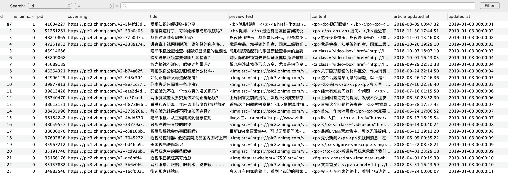

# ZhihuZhuanlanCrawler
知乎专栏爬虫



## usage

```go
package main

import (
	"fmt"
	"github.com/solarhell/ZhihuZhuanlanCrawler"
	"log"
	"net/http"
	"os"
	"time"
)

func main() {
	log.SetFlags(log.LstdFlags | log.Lshortfile)

    const debug = true

	c := ZhihuZhuanlanCrawler.NewClient(&http.Client{
		Timeout: 30 * time.Second,
		Transport: &ZhihuZhuanlanCrawler.DebugRequestTransport{
			RequestHeader:  debug,
			RequestBody:    debug,
			ResponseHeader: debug,
			ResponseBody:   debug,
			Transport: &http.Transport{
				IdleConnTimeout: 30 * time.Second,
			},
		},
	})

	const columnName = "OTalk"

	pinnedArticlePidAndAuthor, err := c.GetPinnedArticlePidAndAuthor(columnName)
	if err != nil {
		log.Println(err)
		os.Exit(1)
	}

	fmt.Printf("%+v\n", *pinnedArticlePidAndAuthor)

	pinnedArticle, err := c.GetSingleArticle(pinnedArticlePidAndAuthor.ID)
	if err != nil {
		log.Println(err)
		os.Exit(1)
	}

	fmt.Printf("%+v\n", *pinnedArticle)

	pids, err := c.GetArticlesListPids(columnName)
	if err != nil {
		log.Println(err)
		os.Exit(1)
	}

	for _, pid := range pids {
		if pid == pinnedArticle.ID {
			continue
		}
		article, err := c.GetSingleArticle(pid)
		if err != nil {
			log.Println(err)
			os.Exit(1)
		}
		fmt.Printf("%+v\n", *article)
	}
}
```

## credits

httpClient的代码来自 https://github.com/mozillazg/go-cos/blob/master/debug/http.go 感谢🙏

